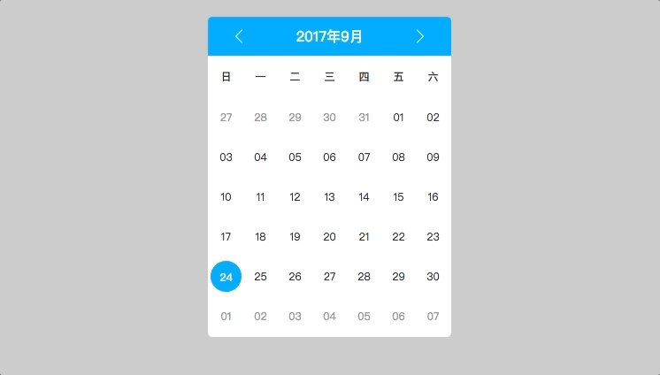

# vortex-calendar

[![NPM version][npm-image]][npm-url]
[![build status][travis-image]][travis-url]
[![node version][node-image]][node-url]
[![npm download][download-image]][download-url]
[![npm license][license-image]][license-url]

[npm-image]: https://img.shields.io/npm/v/vortex-calendar.svg?style=flat-square
[npm-url]: https://npmjs.org/package/vortex-calendar
[travis-image]: https://img.shields.io/travis/YutHelloWorld/calendar.svg?style=flat-square
[travis-url]: https://travis-ci.org/YutHelloWorld/calendar
[node-image]: https://img.shields.io/badge/node.js-%3E=_6.11-green.svg?style=flat-square
[node-url]: http://nodejs.org/download/
[download-image]: https://img.shields.io/npm/dm/vortex-calendar.svg?style=flat-square
[download-url]: https://npmjs.org/package/vortex-calendar
[license-image]: https://img.shields.io/github/license/mashape/apistatus.svg?style=flat-square
[license-url]: https://github.com/YutHelloWorld/calendar/blob/master/LICENSE
A light calendar 📅 .



## Installation


```bash
# npm install vortex-calendar
yarn add vortex-calendar
```

## Usage

```JS
import Calendar from 'vortex-calendar'
import React from 'react'
import {render} from 'react-dom'

const MOUNT_NODE = document.getElementById('root')
render(<Calendar
  minDate="2017-06-01"
  locale="zh"
  onSelect={(v) => console.log(v)}
/>, MOUNT_NODE)
```

## Prop Types

|Property|Type|Default|Description|
|:---:|:---:|:---:|:---:|
|minDate|String ('YYYY-MM-DD')| | The minimum date that is selectable|
|maxDate|String ('YYYY-MM-DD')| | The maximum date that is selectable|
|onSelect|Function| | Callback invoked after date select|
|locale|String| 'en'| By default, calendar comes with the English locale.<br>You can set 'zh' for Chinese.|

## Contributing

1. Clone this repository.

```bash
git clone https://github.com/YutHelloWorld/calendar.git <your project name>
cd <your project name>
```

2. Install all dependencies by `yarn` or `npm i`.Then code in `./src`.

3. Run `yarn build` && `yarn start` to see changes with demo.

4. Pull your request.

## License

The MIT License.
